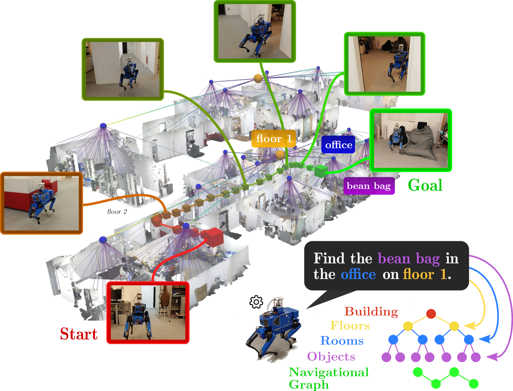
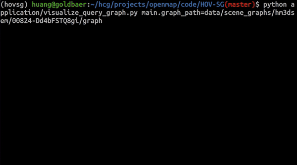

# HOV-SG: Hierarchical Open-Vocabulary 3D Scene Graphs for Language-Grounded Robot Navigation


<p align="center">
  
</p>

## Requirements
This was done on Ubuntu 22.04 with cuda 12.1 and python 3.10.

## Setup

### Install the virtual environment
Navigate to HOV-SG repo and create a virtual environment.
```bash
git clone https://github.com/ArghyaChatterjee/HOV-SG.git
cd HOV-SG/
python3.10 -m venv hov_sg_venv
source hov_sg_venv/bin/activate
pip3 install --upgrade pip setuptools wheel
pip3 install -r requirements.txt
```

### Install Habitat-Sim
Inside the virtual environment, install habitat-sim.
```bash
git clone --branch stable https://github.com/facebookresearch/habitat-sim.git
cd habitat-sim
pip3 install . -v
```

### Install HOV-SG 
This step will install the HOV-SG as a python package:
```bash
cd ..
pip3 install -e .
```

### Download OpenCLIP
HOV-SG uses the Open CLIP model to extract features from RGB-D frames. To download the Open CLIP model checkpoint `CLIP-ViT-H-14-laion2B-s32B-b79K` please refer to [Open CLIP](https://huggingface.co/laion/CLIP-ViT-H-14-laion2B-s32B-b79K).
```bash
mkdir checkpoints
wget https://huggingface.co/laion/CLIP-ViT-H-14-laion2B-s32B-b79K/resolve/main/open_clip_pytorch_model.bin?download=true -O checkpoints/temp_open_clip_pytorch_model.bin && mv checkpoints/temp_open_clip_pytorch_model.bin checkpoints/laion2b_s32b_b79k.bin
```
Another option is to use the OVSeg fine-tuned Open CLIP model, which is available under [here](https://github.com/facebookresearch/ov-seg):
```bash
pip3 install gdown
gdown --fuzzy https://drive.google.com/file/d/17C9ACGcN7Rk4UT4pYD_7hn3ytTa3pFb5/view -O checkpoints/ovseg_clip.pth
```

### Download SAM
HOV-SG uses [SAM](https://github.com/facebookresearch/segment-anything) to generate class-agnostic masks for the RGB-D frames. To download the SAM model checkpoint `sam_v2` execute the following:
```bash
wget https://dl.fbaipublicfiles.com/segment_anything/sam_vit_h_4b8939.pth -O checkpoints/sam_vit_h_4b8939.pth
```

## Dataset Preparation

HOV-SG takes posed RGB-D sequences as input. In order to produce hierarchical multi-story scenes we make use of the Habitat MatterPort 3D Semantics dataset ([HM3DSem](https://aihabitat.org/datasets/hm3d-semantics/)). Download the [Habitat Matterport 3D Semantics](https://github.com/matterport/habitat-matterport-3dresearch) dataset. YOu have to download these specific datasets:

- [hm3d-val-glb-v0.2.tar](https://api.matterport.com/resources/habitat/hm3d-val-glb-v0.2.tar)	val	glb	4G

- [hm3d-val-habitat-v0.2.tar](https://api.matterport.com/resources/habitat/hm3d-val-habitat-v0.2.tar)	val	habitat	3.3G

- [hm3d-val-semantic-annots-v0.2.tar](https://api.matterport.com/resources/habitat/hm3d-val-semantic-annots-v0.2.tar)	val	semantic-annots	2.0G

- [hm3d-val-semantic-configs-v0.2.tar](https://api.matterport.com/resources/habitat/hm3d-val-semantic-configs-v0.2.tar)	val	semantic-configs	40K

Make sure that the raw HM3D dataset has the following structure:
    
```
  data
    ├── hm3dsem
    │   ├── hm3d_annotated_basis.scene_dataset_config.json
    │   ├── val
    │   │   └── 00824-Dd4bFSTQ8gi
    │   │         ├── Dd4bFSTQ8gi.basis.glb
    │   │         ├── Dd4bFSTQ8gi.basis.navmesh
    │   │         ├── Dd4bFSTQ8gi.glb
    │   │         ├── Dd4bFSTQ8gi.semantic.glb
    │   │         └── Dd4bFSTQ8gi.semantic.txt
    |   ...
    ├── hm3dsem_poses
    |   ├── 00824-Dd4bFSTQ8gi.txt
    |   ├── ...
    |   ├── Per_Scene_Floor_Sep.csv
    |   ├── ...
    └── hm3dsem_walks
          └── val
              └── 00824-Dd4bFSTQ8gi
              ├── ...
    ...
```

We used the following scenes from the Habitat Matterport 3D Semantics dataset in our evaluation:
```
  1. `00824-Dd4bFSTQ8gi`
  2. `00829-QaLdnwvtxbs`
  3. `00843-DYehNKdT76V`
  4. `00861-GLAQ4DNUx5U`
  5. `00862-LT9Jq6dN3Ea`
  6. `00873-bxsVRursffK`
  7. `00877-4ok3usBNeis`
  8. `00890-6s7QHgap2fW`
```

1. Our method requires posed input data. Because of that, we recorded trajectories for each sequence we evaluate on. We provide a script (`hovsg/data/hm3dsem/gen_hm3dsem_walks_from_poses.py`) that turns a set of camera poses (`hovsg/data/hm3dsem/metadata/poses`) into a sequence of RGB-D observations using the [habitat-sim](https://github.com/facebookresearch/habitat-sim) simulator. The output includes RGB, depth, poses and frame-wise semantic/panoptic ground truth:
```bash
  python3 hovsg/data/habitat/gen_hm3dsem_walks_from_poses.py --dataset_dir hovsg/data/hm3dsem --save_dir hovsg/data/hm3dsem_walks/
```

2. Secondly, we construct a new hierarchical graph-structured dataset that is called `hm3dsem_walks` that includes ground truth based on all observations recorded. To produce this ground-truth data please execute the following: First, define the following config paths: `main.package_path`, `main.dataset_path`, `main.raw_data_path`, and `main.save_path` under `config/create_graph.yaml`. For each scene, define the `main.scene_id`, `main.split`. Next, execute the following to obtain floor-, region-, and object-level ground truth data per scene. We utilize every recorded frame without skipping (see parameter `dataset.hm3dsem.gt_skip_frames`) and recommend 128 GB of RAM to compile this as the scenes differ in size:
```bash
cd HOV-SG
python3 hovsg/data/hm3dsem/create_hm3dsem_walks_gt.py
```

To evaluate semantic segmentation cababilities, we used [ScanNet](http://www.scan-net.org/) and [Replica](https://github.com/facebookresearch/Replica-Dataset).

### ScanNet
To get an RGBD sequence for ScanNet, download the ScanNet dataset from the [official website](http://www.scan-net.org/). The dataset contains RGB-D frames compressed as .sens files. To extract the frames, use the [SensReader/python](https://github.com/ScanNet/ScanNet/blob/master/SensReader/python).
We used the following scenes from the ScanNet dataset:
```
  1. `scene0011_00`
  2. `scene0050_00`
  2. `scene0231_00`
  3. `scene0378_00`
  4. `scene0518_00`
```

### Replica
To get an RGBD sequence for Replica, Instead of the original Replica dataset, download the scanned RGB-D trajectories of the Replica dataset provided by [Nice-SLAM](https://github.com/cvg/nice-slam). It contains rendered trajectories using the mesh models provided by the original Replica datasets. 
Download the Replica RGB-D scan dataset using the downloading [script](https://github.com/cvg/nice-slam/blob/master/scripts/download_replica.sh) in [Nice-SLAM](https://github.com/cvg/nice-slam#replica-1).

```bash
wget https://cvg-data.inf.ethz.ch/nice-slam/data/Replica.zip -O data/Replica.zip && unzip data/Replica.zip -d data/Replica_RGBD && rm data/Replica.zip 
```

To evaluate against the ground truth semantics labels, you also need also to download the original Replica dataset from the [Replica](https://github.com/facebookresearch/Replica-Dataset) as it contains the ground truth semantics labels as .ply files.
```bash
git clone https://github.com/facebookresearch/Replica-Dataset.git data/Replica-Dataset
chmod +x data/Replica-Dataset/download.sh && data/Replica-Dataset/download.sh data/Replica_original
```
We only used the following Scene IDs from the Replica dataset:
```
  1. `office0`
  2. `office1`
  3. `office2`
  4. `office3`
  5. `office4`
  6. `room0`
  7. `room1`
  8. `room2`
```

## Datasets file strutcre
The Data folder should have the following structure:
  
```
├── hm3dsem_walks
│   ├── val
│   │   ├── 00824-Dd4bFSTQ8gi
│   │   │   ├── depth
│   │   │   │   ├── Dd4bFSTQ8gi-000000.png
│   │   │   │   ├── ...
│   │   │   ├── rgb
│   │   │   │   ├── Dd4bFSTQ8gi-000000.png
│   │   │   │   ├── ...
│   │   │   ├── semantic
│   │   │   │   ├── Dd4bFSTQ8gi-000000.png
│   │   │   │   ├── ...
│   │   │   ├── pose
│   │   │   │   ├── Dd4bFSTQ8gi-000000.png
│   │   │   │   ├── ...
|   |   ├── 00829-QaLdnwvtxbs
|   |   ├── ..
├── Replica
│   ├── office0
│   │   ├── results
│   │   │   ├── depth0000.png
│   │   │   ├── ...
│   │   |   ├── rgb0000.png
│   │   |   ├── ...
│   │   ├── traj.txt
│   ├── office1
│   ├── ...
├── ScanNet
│   ├── scans
│   │   ├── scene0011_00
│   │   │   ├── color
│   │   │   │   ├── 0.jpg
│   │   │   │   ├── ...
│   │   │   ├── depth
│   │   │   │   ├── 0.png
│   │   │   │   ├── ...
│   │   │   ├── poses
│   │   │   │   ├── 0.txt
│   │   │   │   ├── ...
│   │   │   ├── internsics
│   │   │   │   ├── intrinsics_color.txt
│   │   │   │   ├── intrinsics_depth.txt
│   │   ├── ..
```

## Demo Usage

### Create scene graphs (only for Habitat Matterport 3D Semantics):
In `creat_graph.yaml` inside `config` folder,  the `skip_frame` paramter is set to `10` and `merge_type` parameter to `hierarchical`. This will skip every 10 frames and then process the next frame (for 2000 frames, it will end up processing 200 frames for the scene graph generation) and `merge_type` setting is important since `sequential` doesn't work sometimes for low configuration pc's.  

```bash
python3 application/create_graph.py main.dataset=hm3dsem main.dataset_path=hovsg/data/hm3dsem_walks/ main.save_path=hovsg/data/scene_graphs/
```
This will generate a scene graph for the specified RGB-D sequence and save it. The following files are generated:</summary>

```
├── graph
│   ├── floors
│   │   ├── 0.json
│   │   ├── 0.ply
│   │   ├── 1.json
│   │   ├── ...
│   ├── rooms
│   │   ├── 0_0.json
│   │   ├── 0_0.ply
│   │   ├── 0_1.json
│   │   ├── ...
│   ├── objects
│   │   ├── 0_0_0.json
│   │   ├── 0_0_0.ply
│   │   ├── 0_0_1.json
│   │   ├── ...
│   ├── nav_graph
├── tmp
├── full_feats.pt
├── mask_feats.pt
├── full_pcd.ply
├── masked_pcd.ply
```
The `graph` folder contains the generated scene graph hierarchy: 
- The first number in the file name represents the floor number, 
- The second number represents the room number, and 
- The third number represents the object number. 
- The `tmp` folder holds intermediate results obtained throughout graph construction. 
- The `full_feats.pt` and `mask_feats.pt` contain the features extracted from the RGBD frames using the Open CLIP and SAM models. the former contains per point features and the latter contains the features for the object masks. 
- The `full_pcd.ply` and `masked_pcd.ply` contain the point cloud representation of the RGB-D frames and the instance masks of all objects, respectively.

</details>

### Visualize scene graph
```bash
python3 application/visualize_graph.py graph_path=data/scene_graphs/hm3dsem/00824-Dd4bFSTQ8gi/graph
```


### Interactive visualization of scene graphs and natural language queries

#### Setup OpenAI
In order to test graph queries with HOV-SG, you need to setup an OpenAI API account with the following steps:
1. [Sign up an OpenAI account](https://openai.com/blog/openai-api), login your account, and bind your account with at least one payment method.
2. [Get you OpenAI API keys](https://platform.openai.com/account/api-keys), copy it.
3. Open your `~/.bashrc` file, paste a new line `export OPENAI_KEY=<your copied key>`, save the file, and source it with command `source ~/.bashrc`. Another way would be to run `export OPENAI_KEY=<your copied key>` in the teminal where you want to run the query code.

#### Evaluate query against pre-built hierarchical scene graph 
```bash
python application/visualize_query_graph.py main.graph_path=data/scene_graphs/hm3dsem/00824-Dd4bFSTQ8gi/graph
```
After launching the code, you will be asked to input the hierarchical query. An example is `chair in the living room on floor 0`. You can see the visualization of the top 5 target objects and the room it lies in.


### Extract feature map for semantic segmentation (only ScanNet and Replica)
```bash
python application/semantic_segmentation.py main.dataset=replica main.dataset_path=Replica/office0 main.save_path=data/sem_seg/office0
```

### Evaluate semantic segmentation (only ScanNet and Replica)
```bash
python application/eval/evaluate_sem_seg.py dataset=replica scene_name=office0 feature_map_path=data/sem_seg/office0
```

### Evaluate predicted scene graphs (only Habitat 3D Semantics)
- Define the scene identifiers and paths of ground truth and the predicted scene graph in the `config/eval_graph.yaml`.
- Run the graph evaluation method:
```bash
python3 application/eval/evaluate_graph.py 
```
